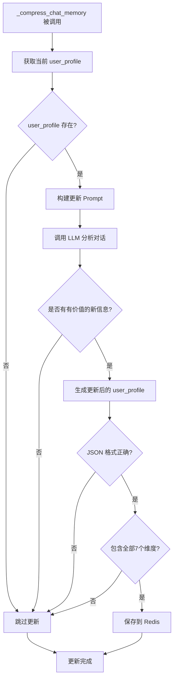

# User Profile 动态更新设计文档

## 1. 概述

### 1.1 项目背景

在 FoxChatRAG 系统中，用户画像（user_profile）用于存储对用户的长期认知，包括核心身份、性格、语言风格等7个固定维度。

**现状问题**：
- user_profile 在用户首次上传记忆时生成，之后不再更新
- 随着对话进行，用户可能透露新的兴趣、偏好、行为模式
- 这些新信息无法被捕获，导致 AI 对用户的认知停滞

**目标**：
- 在消息压缩时同步更新 user_profile
- 保持7个维度结构不变
- 确保只有有价值的信息才更新
- 区分"稳定的性格特质"和"临时情绪状态"

---

## 2. 设计原则

### 2.1 核心原则

| 原则 | 说明 |
|------|------|
| **同步更新** | 在 `_compress_chat_memory()` 触发时同步更新 |
| **严格过滤** | 只更新有价值的新信息，忽略临时情绪和闲聊 |
| **持续迭代** | 基于最新的 user_profile 持续优化 |
| **结构稳定** | 强制保持7个维度结构不变 |
| **安全优先** | 更新失败时保留原数据 |

### 2.2 数据职责分离

```
┌─────────────────────────────────────────────────────────────┐
│                     长期存储 (user_profile)                   │
│  ┌─────────────────────────────────────────────────────┐  │
│  │ 核心身份、核心性格、语言风格、互动模式、价值观、       │  │
│  │ 长期兴趣、绝对边界                                    │  │
│  │                                                       │  │
│  │ 特点：稳定性高，变化缓慢                               │  │
│  │ 更新条件：必须是有意义的性格特质或长期偏好              │  │
│  └─────────────────────────────────────────────────────┘  │
└─────────────────────────────────────────────────────────────┘

┌─────────────────────────────────────────────────────────────┐
│                     动态存储 (memory_bank)                   │
│  ┌─────────────────────────────────────────────────────┐  │
│  │ 近期事件、关键对话、情感状态、临时状态                 │  │
│  │                                                       │  │
│  │ 特点：变化频繁，生命周期短                             │  │
│  │ 更新条件：任何有意义的对话内容                          │  │
│  └─────────────────────────────────────────────────────┘  │
└─────────────────────────────────────────────────────────────┘
```

**关键区分**：

| 内容类型 | 示例 | 存储位置 | 是否更新 user_profile |
|---------|------|---------|----------------------|
| 稳定的性格特质 | 敏感、内向、冲动、爱幻想 | user_profile | ✅ |
| 长期行为模式 | 压力大就想逃避、习惯性抱怨 | user_profile | ✅ |
| 长期兴趣偏好 | 喜欢钢琴、讨厌运动 | user_profile | ✅ |
| 临时情绪状态 | 最近好烦、今天开心 | memory_bank | ❌ |
| 闲聊内容 | 今天天气真好 | - | ❌ |
| 一次性事件 | 刚买了新钢琴 | memory_bank + 兴趣 | ✅ 更新兴趣 |

---

## 3. user_profile 结构

### 3.1 固定7个维度

```json
{
  "核心身份": {
    "姓名": "xxx",
    "年龄": "xxx",
    "职业": "xxx",
    "与AI关系": "xxx"
  },
  "核心性格": {
    "主导性格": "敏感、内向、懦弱、爱幻想",
    "矛盾侧面": "装作忧伤却付出甚少；渴望表达爱意却总是逃避",
    "小缺点": "爱哭、淘气、不擅长与人交往"
  },
  "语言风格": {
    "口头禅": "xxx",
    "语气词": "xxx",
    "句式习惯": "常用比喻和抒情句式"
  },
  "互动模式": {
    "开启话题": "xxx",
    "安慰方式": "xxx",
    "开玩笑": "通过调侃"
  },
  "价值观": {
    "人生态度": "认为某些事是命中注定",
    "底线": "xxx",
    "讨厌事物": "xxx"
  },
  "长期兴趣": {
    "爱好": "在城中村菜地里疯跑、看电视",
    "喜欢": "浪漫的事物、看着喜欢的人",
    "讨厌": "xxx"
  },
  "绝对边界": {
    "绝不说": ["xxx"],
    "绝不做": ["xxx"]
  }
}
```

### 3.2 更新判断标准

| 维度 | 可更新的内容 | 不可更新的内容 |
|------|------------|--------------|
| 核心身份 | 姓名、职业等明确信息 | - |
| 核心性格 | 稳定的性格特质、长期行为模式 | 临时情绪、近期心情 |
| 语言风格 | 口头禅、句式习惯 | 单次使用的表达 |
| 互动模式 | 稳定的互动习惯 | 偶发的互动方式 |
| 价值观 | 长期坚持的态度、底线 | 临时的想法 |
| 长期兴趣 | 稳定的爱好、长期偏好 | 一次性尝试、临时兴趣 |
| 绝对边界 | 明确的禁忌 | 不确定的边界 |

---

## 4. 更新流程

### 4.1 触发时机

- **触发点**：`_compress_chat_memory()` 函数
- **触发条件**：累积30条消息后触发压缩时
- **更新频率**：每次压缩时尝试更新

### 4.2 更新流程图



### 4.3 代码集成点

位置：`app/service/chat_msg_service.py` - `_compress_chat_memory()` 函数

```python
async def _compress_chat_memory(user_id: str, llm_id: str):
    # ... 现有逻辑：提取消息、总结、压缩 memory_bank
    
    # 新增：更新 user_profile
    current_profile = await _get_user_profile(user_id, llm_id)
    if current_profile:
        updated_profile = await _update_user_profile(
            current_profile, 
            recent_msg_list
        )
        if updated_profile and _validate_profile_structure(updated_profile):
            await _save_user_profile(updated_profile, user_id, llm_id)
        else:
            logger.debug("user_profile 更新失败或格式不完整，保留原数据")
```

---

## 5. Prompt 设计

### 5.1 user_profile_updater.md 模板

**文件路径**：`app/core/prompts/user_profile_updater.md`

**设计要点**：

1. **输入**：
   - 当前 user_profile（JSON 格式）
   - 最近对话历史（聊天记录列表）

2. **分析任务**：
   - 识别对话中透露的稳定性格特质
   - 识别长期兴趣爱好
   - 识别语言风格和互动模式
   - 忽略临时情绪和闲聊

3. **输出要求**：
   - 必须返回完整的7个维度
   - 有新信息 → 更新对应字段
   - 无新信息 → 保留原值（**无论原值是什么**）

4. **关键指令**：
   - 只更新有价值的性格特征和长期偏好
   - 不更新临时情绪（"最近好烦"、"今天开心"）
   - 不更新闲聊内容
   - 如果对话没有提供任何有价值的信息，返回原 profile（不做任何更改）

### 5.2 更新判断示例

| 对话内容 | 是否算"有价值的信息" | 原因 |
|---------|-------------------|------|
| "我最近好烦啊" | ❌ | 临时情绪，非性格特质 |
| "每次压力大我就想逃避" | ✅ | 揭示稳定的应对模式 |
| "我刚买了新钢琴" | ✅ | 长期兴趣的更新 |
| "今天天气真好" | ❌ | 闲聊，无信息价值 |
| "我是个很内向的人" | ✅ | 自我定义的性格特质 |
| "我不喜欢被批评" | ✅ | 价值观/底线的更新 |

---

## 6. 错误处理

### 6.1 错误场景与处理策略

| 错误场景 | 处理策略 | 原因 |
|---------|---------|------|
| JSON 解析失败 | 保留原 user_profile | 避免损坏数据 |
| 缺少必要维度 | 保留原 user_profile | 确保结构完整性 |
| LLM 服务不可用 | 保留原 user_profile | 安全优先 |
| 网络超时 | 保留原 user_profile | 重试机制在压缩时统一处理 |

### 6.2 日志记录

```python
# 更新成功
logger.info(f"user_profile 更新成功: user_id={user_id}, llm_id={llm_id}")

# 更新失败（JSON 解析）
logger.warning(f"user_profile 更新失败: JSON 解析错误, user_id={user_id}")

# 更新失败（结构不完整）
logger.warning(f"user_profile 更新失败: 缺少维度, user_id={user_id}")

# 跳过更新（无有价值信息）
logger.debug(f"user_profile 无需更新: 对话中无有价值信息, user_id={user_id}")
```

---

## 7. 技术实现

### 7.1 新增文件

| 文件 | 说明 |
|------|------|
| `app/core/prompts/user_profile_updater.md` | 更新 Prompt 模板 |

### 7.2 修改文件

| 文件 | 修改内容 |
|------|---------|
| `app/service/chat_msg_service.py` | 添加更新逻辑和辅助函数 |

### 7.3 新增函数

| 函数 | 说明 |
|------|------|
| `_build_profile_updater_chain()` | 构建 LLM 更新 chain |
| `_update_user_profile()` | 执行 user_profile 更新 |
| `_validate_profile_structure()` | 验证更新后的结构完整性 |
| `_get_user_profile()` | 从 Redis 获取当前 profile |
| `_save_user_profile()` | 保存更新后的 profile 到 Redis |

### 7.4 Redis Key

```
chat:memory:{user_id}:{llm_id}:user_profile
```

---

## 8. 测试场景

### 8.1 功能测试

| 测试场景 | 输入 | 预期输出 |
|---------|------|---------|
| 正常更新 | 稳定的性格信息 | user_profile 相应字段更新 |
| 临时情绪 | "最近好烦" | 不更新任何字段 |
| 闲聊 | "天气真好" | 不更新任何字段 |
| 新兴趣 | "我开始学钢琴了" | 更新"长期兴趣.爱好" |
| 自我定义 | "我是个很内向的人" | 更新"核心性格" |

### 8.2 边界测试

| 测试场景 | 输入 | 预期输出 |
|---------|------|---------|
| 空对话 | [] | 保留原 profile |
| 全闲聊 | ["你好", "在吗", "嗯嗯"] | 保留原 profile |
| LLM 返回非 JSON | "这是一段文字" | 保留原 profile |
| 缺少维度 | 缺少"绝对边界" | 保留原 profile |

### 8.3 验证测试

- ✅ 更新后 Redis 中的 user_profile 结构完整
- ✅ 7个维度都存在
- ✅ 每个维度包含必要的子字段
- ✅ 闲聊对话不覆盖已有画像

---

## 9. 性能考虑

### 9.1 LLM 调用成本

- **触发频率**：每30条消息压缩时（约每15-30分钟一次对话）
- **额外成本**：每次压缩增加1次 LLM 调用
- **优化方向**：复用现有的 `qwen4b_model`

### 9.2 Redis 操作

- **读取**：1次 `get` 操作
- **写入**：1次 `set` 操作
- **影响**：可忽略

---

## 10. 文档版本

| 版本 | 日期 | 说明 |
|------|------|------|
| 1.0 | 2026-04-10 | 初始版本 |

---

## 11. 状态

- [x] 设计完成
- [ ] 用户审查
- [ ] 实现
- [ ] 测试
