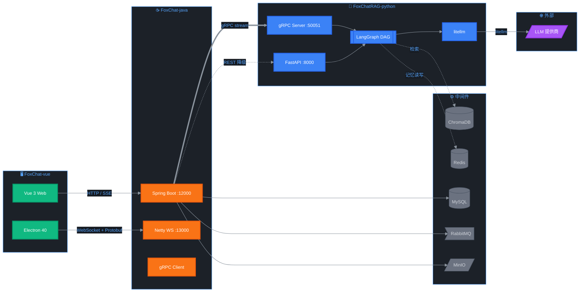
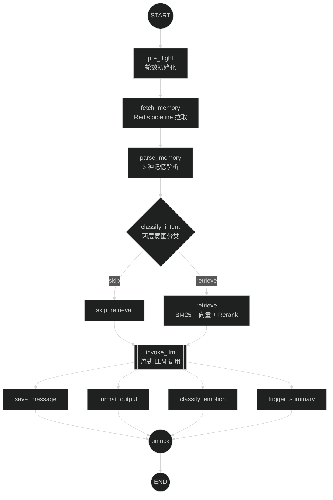
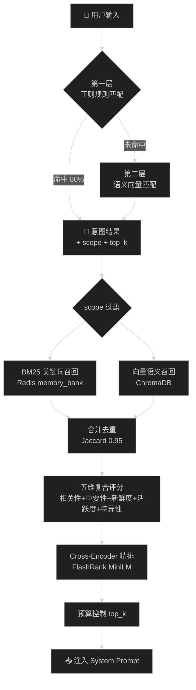
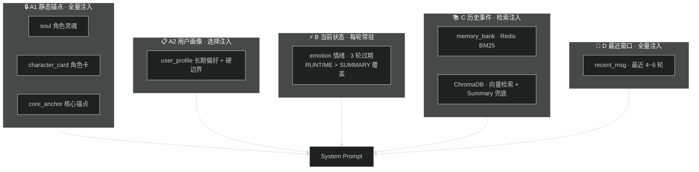
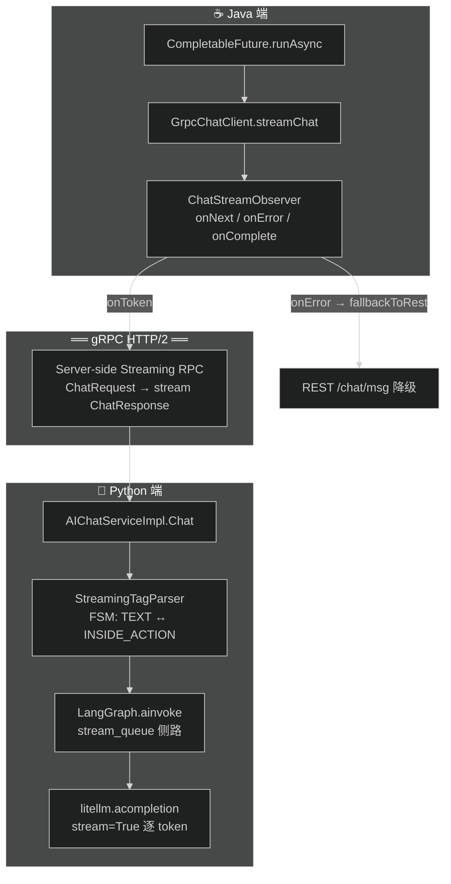

# FoxChat 🦊 — AI 驱动智能即时通讯系统

基于 **Spring Boot 3 + Netty + FastAPI + LangGraph** 构建的 AI 驱动即时通讯平台。融合多阶段混合 RAG 检索、DAG 推理编排与断点容错、分层认知记忆及跨语言流式推理，让 AI 伙伴真正"记住"你。

---

## 🏗️ 系统架构



| 端 | 职责 | 端口 |
|:---|:-----|:-----|
| **FoxChat-java** | 用户体系、好友/群组、WebSocket 长连接、Protobuf 二进制协议、gRPC 客户端、SSE 推送 | HTTP 12000, WS 13000 |
| **FoxChatRAG-python** | AI 对话编排、多阶段记忆、RAG 混合检索、情绪状态管理、gRPC 流式服务 | HTTP 8000, gRPC 50051 |
| **FoxChat-vue** | Web 前端 + Electron 桌面端 | 5173 |

---

## 🌟 核心亮点

### 1. LangGraph DAG 推理编排

11 节点有向无环图 + SQLite 节点级检查点实现断点容错，后处理四路并行。



| 特性 | 说明 |
|:-----|:-----|
| **四路并行后处理** | 保存消息 / 格式化输出 / 情绪分类 / 触发总结 同时执行 |
| **断点容错** | SQLite/MemorySaver checkpointer，异常恢复跳过已完成节点 |
| **流式侧路** | `contextvars` 传递 `stream_queue` 绕过 checkpointer 序列化 |
| **条件路由** | 意图分类结果决定走 `retrieve`（检索增强）还是 `skip_retrieval`（直接回答） |

### 2. 多阶段混合 RAG 检索

两层意图分类器驱动 10 种意图差异化检索，BM25 + ChromaDB 双路召回 → 五维复合评分 → Cross-Encoder 精排。



| 意图类型 | 检索策略 | scope |
|:---------|:---------|:------|
| `casual_chat` | 跳过检索 | — |
| `identity_q` | BM25 + 向量 | identity |
| `preference_q` | BM25 + 向量 | preference |
| `boundary_q` | BM25 + 向量 | boundary |
| `follow_up_q` | BM25 + 向量 | follow_up, commitment |
| `deep_recall` | 全库检索 | all |

### 3. 分层认知记忆架构

A/B/C/D 四层记忆体系，Jaccard 去重，每 18 轮总结热更新。



**关键机制**：

- **去重**：检索去重 0.95（严格） / 总结去重 0.6（宽松），C 层与 D 层重叠度 ≥ 70% 抑制
- **优先级裁决**：A2（硬边界）> B（runtime 状态）> C（历史事件）> D（最近窗口）
- **情绪覆盖**：过期 > 来源等级（USER_EXPLICIT 3 > RUNTIME 2 > SUMMARY 1）> 置信度差值 > 值变化
- **三级触发**：定时器 45s（≥18 条）| 节点内 max（≥30 条）| Redis 硬上限（40 条）
- **总结流程**：`asyncio.gather` 并行执行摘要生成 + 事件提取 + 用户画像更新

### 4. 自定义二进制私有通信协议

16 字节定长头部 + Protobuf 序列化，解决 Netty 多端移植 + HTTPOnly JWT 鉴权 + Redis Pub/Sub 跨节点广播。

```
┌──────────┬──────┬────────┬─────────┬──────────┬──────────┐
│ Magic 4B │ Ver  │ Serial │ MsgType │ Length 4B│ Reserved │
│ 0xCAFE   │  1B  │  1B    │   2B    │ Body Size│   4B     │
│  BABE    │      │  (PB)  │         │          │          │
└──────────┴──────┴────────┴─────────┴──────────┴──────────┘
```

- **MsgType**：1101(私聊) / 1201(群聊) / 1102(签收) / 1103(心跳) / 1104/1105(好友申请) / 1106/1107(上下线)
- **鉴权**：WebSocket 握手阶段 `CookieAuthHandler` 解析 Cookie 中 HttpOnly JWT → Redis 二次验证
- **广播**：`Redis Pub/Sub` → 多实例间消息路由 + 在线状态同步

### 5. 跨语言 gRPC 流式推理

Java ↔ Python 异构服务端流式 RPC，`StreamingTagParser` 有限状态机处理标签截断，三级超时 + 失败自动降级 REST。



- **FSM 状态机**：TEXT / INSIDE_ACTION 两状态，`<action>` 残缺标签 buffer 等待补全
- **三级超时**：120s 总超时（gRPC `withDeadlineAfter` + litellm `timeout`）+ token 间隔超时 + 首 token 超时
- **降级**：gRPC 失败 → `onError` 回调 → `fallbackToRest()` → Feign REST 非流式

---

## 🛠️ 技术栈

| 模块 | 技术 |
|:-----|:-----|
| **IM 后端** | Spring Boot 3.5 + Netty 4.1 + MyBatis Plus + gRPC (Java) |
| **AI 后端** | FastAPI + LangGraph + LangChain + litellm + gRPC (Python) |
| **前端** | Vue 3 (Composition API) + Vite 7 + Element Plus + Electron 40 |
| **协议** | Protobuf 3 (WebSocket 二进制 + gRPC) + HTTP/2 |
| **数据库** | MySQL 8.0 + Redis (RedisJSON) + ChromaDB (向量) |
| **消息队列** | RabbitMQ (aio-pika) — 文档向量化异步处理 |
| **对象存储** | MinIO — 文件/图片/头像 |
| **LLM 调用** | litellm (统一接口: DeepSeek / OpenAI / Ollama) |
| **RAG 检索引擎** | BM25 (rank_bm25) + ChromaDB 向量 + FlashRank Cross-Encoder |
| **重排序** | FlashRank (ms-marco-MiniLM-L-12-v2) |
| **分词** | jieba (中文分词) |
| **日志** | Loguru (Python) + SLF4J/Logback (Java) |
| **安全** | Spring Security + JWT (HttpOnly Cookie) + Redis 会话管理 |

---

## 📂 项目结构

```
FoxChat/
├── FoxChat-vue/                  # Vue 3 前端 + Electron 桌面端
│   ├── src/
│   │   ├── api/                 # Axios 封装 + API 接口
│   │   ├── components/          # 通用组件
│   │   ├── views/               # 页面视图（聊天/好友/群组/设置）
│   │   ├── utils/               # 工具函数 + Protobuf 编解码
│   │   └── proto/               # Protobuf .proto 定义
│   └── electron/                # Electron 主进程
│
├── FoxChat-java/                 # Spring Boot IM 核心
│   ├── foxChat-web/             # Controller 层 (REST API)
│   ├── foxChat-service/         # Service 业务层 + gRPC Client
│   ├── foxChat-netty/           # Netty WebSocket + Protobuf 编解码
│   ├── foxChat-common/          # 公共工具 (JWT, MinIO, Redis)
│   └── foxChat-pojo/            # Entity / DTO / VO / Protobuf 生成类
│
├── FoxChatRAG-python/            # FastAPI AI 记忆对话服务
│   ├── app/
│   │   ├── api/                 # REST 路由 (chat / rag / llm-config)
│   │   ├── grpc/                # gRPC 服务端 (AIChatService)
│   │   ├── service/chat/
│   │   │   ├── graph/           # LangGraph DAG (graph / nodes / state / router)
│   │   │   ├── llm/             # LLM 调用 + Prompt 构建 + 意图分类
│   │   │   ├── memory/          # 记忆总结 / 事件提取 / 历史检索 / 定时调度
│   │   │   ├── state/           # 状态管理 / 会话锁 / 轮次计数
│   │   │   ├── parsing/         # StreamingTagParser (流式标签解析)
│   │   │   ├── profile/         # 情绪分类 / 用户画像更新
│   │   │   └── strategy/        # LLM 调用策略封装
│   │   ├── core/
│   │   │   ├── prompts/         # Prompt 模板 (.md)
│   │   │   ├── llm_model/       # LLM 模型 + Rerank 模型配置
│   │   │   ├── mq/              # RabbitMQ 消费者
│   │   │   └── db/              # Redis + MySQL 连接
│   │   ├── schemas/             # Pydantic 数据模型
│   │   ├── common/constant/     # 常量定义（意图配置等）
│   │   └── exception/           # 全局异常处理
│   ├── proto/                   # gRPC .proto 定义
│   ├── store/                   # ChromaDB 向量库本地存储
│   └── main.py                  # FastAPI 入口 + lifespan 管理
│
├── docker-compose.yml           # 开发环境中间件
├── docker-compose.prod.yml      # 生产环境部署
├── FoxChat.sql                  # 数据库初始化脚本
├── .env.example                 # 环境变量模板
├── 模拟面试复盘.md               # 26 题面试 Q&A 复盘
└── README.md                    # 本文件
```

---

## 🚀 快速启动

### 前置依赖

- **JDK 17+** / **Python 3.12+** / **Node.js 18+**
- **Docker** (运行中间件)

### 1. 启动中间件

```bash
# 启动 MySQL + Redis + MinIO + RabbitMQ
docker compose up -d

# 初始化数据库
mysql -u root -p < FoxChat.sql
```

### 2. 配置环境变量

```bash
# 根目录
cp .env.example .env   # 编辑填写密钥和密码

# Python 端
cd FoxChatRAG-python
cp .env.example .env   # 编辑填写 LLM API Key 等
pip install -r requirements.txt

# 生成 gRPC stub
python -m grpc_tools.protoc -Iproto --python_out=app/grpc --grpc_python_out=app/grpc proto/ai_chat.proto
```

### 3. 启动服务

```bash
# 1) Python AI 服务 (端口 8000 + gRPC 50051)
cd FoxChatRAG-python
uvicorn main:app --host 0.0.0.0 --port 8000

# 2) Java IM 服务 (端口 12000 + Netty WS 13000)
cd FoxChat-java
./gradlew bootRun

# 3) 前端 (端口 5173)
cd FoxChat-vue
npm install && npm run dev

# 4) Electron 桌面端
npm run electron:build
```

---

## 📡 服务端口速查

| 服务 | 端口 | 协议 | 说明 |
|:-----|:-----|:-----|:-----|
| Java HTTP API | 12000 | HTTP/REST | Spring Boot Controller |
| Java WebSocket | 13000 | WebSocket + Protobuf | Netty 长连接 |
| Python HTTP API | 8000 | HTTP/REST | FastAPI (降级路径) |
| Python gRPC | 50051 | gRPC HTTP/2 | 流式 LLM 推理 |
| Vue Dev Server | 5173 | HTTP | Vite 热更新 |
| MySQL | 3306 | TCP | 持久化数据 |
| Redis | 6379 | TCP | 缓存/会话/记忆 |
| RabbitMQ | 5672 / 15672 | AMQP / HTTP | 消息队列 / 管理面板 |
| MinIO | 9000 / 9001 | HTTP | 对象存储 / 控制台 |

---

## 🔐 敏感配置

以下文件包含密钥、密码等敏感信息，**请勿提交至 Git**（已列入 `.gitignore`）：

| 文件 | 内容 |
|:-----|:-----|
| `FoxChatRAG-python/.env` | LLM API Key、MySQL/Redis/RabbitMQ 密码 |
| `FoxChat-java/**/application-local.yml` | 数据库密码、JWT 密钥、MinIO、邮件授权码 |
| `FoxChat-vue/.env` | 本地 API 地址 |
| `.env`（根目录） | 项目级环境变量 |

首次配置时参考各模块下的 `.env.example`。

---

## 📚 相关文档

| 文档 | 说明 |
|:-----|:-----|
| [FoxChat-java/README.md](./FoxChat-java/README.md) | Java IM 后端文档 |
| [FoxChatRAG-python/README.md](./FoxChatRAG-python/README.md) | Python AI 记忆服务文档 |
| [FoxChatRAG-python/阅读计划.md](./FoxChatRAG-python/阅读计划.md) | Python 端代码阅读指南（分 5 步走） |
| [FoxChat-vue/README.md](./FoxChat-vue/README.md) | 前端 + Electron 文档 |

---

## 📊 记忆系统性能验证

| 测试阶段 | 对话轮次 | 说明 |
|:---------|:---------|:-----|
| 播种期 | 15 轮 | 注入关键记忆点（身份/偏好/关系/边界） |
| 干扰期 | 200 轮 | 随机话题干扰记忆 |
| 验证期 | 15 轮 | 回询关键记忆点 |

**结果**：100% 记忆留存率，200 轮干扰后播种期全部关键事实可检索。

---

*FoxChat — 让 AI 真正记住每一次对话 🦊*
